# Design Specification: New Quality & Configuration Audit Agents 🛠️
**Document Date:** 2026-05-18  
**Topic:** Implementing `optimizador-finops` and `agente-devops` as autonomous quality/compliance agents.

---

## 1. Executive Summary & Purpose

This document specifies the architecture, identity, compliance controls, and integration flow for two new primary agents in the **OpenSkills** ecosystem:

1. **`optimizador-finops`** (Token & Resource Manager): Focused on SQA and risk mitigation concerning computational resources, token usage efficiency, and AI/LLM API economy.
2. **`agente-devops`** (SRE): Focused on SCM (Software Configuration Management), porting environments, securing containerization, and validating CI/CD pipelines.

These agents adopt formal professional roles and enforce international and industry standards, operating without any personal names or surnames in their configurations.

---

## 2. Socio-Technical Identities & Compliance Controls

### A. Agent 1: `optimizador-finops` (SQA & Financial Risk Auditor)
* **Identity:** Encargado de SQA y Gestión de Riesgos de Recursos (QA & Resource Risk Manager).
* **Reference Standards:** 
  * **ISO 31000 / ISO/IEC 31010**: Applied to financial risk assessment, mitigation, and preventative controls regarding computational resource consumption and token leakages.
* **Core Responsibilities:**
  * **API & Token Economy:** Inspects code and configuration files to identify redundant prompts, bloated instruction sets, or excessively large system prompts that escalate expenses.
  * **Algorithm Optimization:** Suggests cache utilization (Redis, SQLite), batching mechanisms, and lighter data structures.
  * **Infinite Loop Mitigation:** Detects recursive or infinite execution structures in agent logic that could trigger massive API billing.
  * **Reporting:** Generates a visually premium HTML dashboard reporting on cost risk, savings recommendations, and efficiency metrics.

---

### B. Agent 2: `agente-devops` (SCM & Secure Infrastructure Auditor)
* **Identity:** Encargado de Gestión de Configuración (SCM) y Despliegue Seguro.
* **Reference Standards:**
  * **IEEE 730:2014**: Software Quality Assurance Plan applied to SCM, configuration items, and build/compilation control.
  * **ISO/IEC 27001:2022**: Information Security Management System controls applied to container deployments, access control, and environment security.
* **Core Responsibilities:**
  * **Safe Containerization:** Checks Dockerfiles and docker-compose.yml files for security practices (e.g., ensuring containers **never run as root**, base images are pinned by specific tags or digest SHAs, and no credentials are hardcoded).
  * **Safe Environment Setup:** Reviews `.env`, configuration patterns, and permissions to prevent information disclosure.
  * **CI/CD Pipeline Security:** Scans GitHub Actions workflow files (`.github/workflows/*.yml`) to ensure action dependencies are pinned by commit SHAs and no credentials are exposed in plaintext.
  * **Codebase SCM Control:** Generates and validates standard SCM items (Dockerfiles, compose, CI templates) based on the project's stack.
  * **Reporting:** Generates a visually premium HTML deployment report detailing SCM items, containerization score, and security findings.

---

## 3. Chronological Project Execution Pipeline

The sequence below illustrates the chronological invocation of agents in a typical project lifecycle, framing the new auditors in their exact stages:

```mermaid
graph TD
    A[1. planning: project-manager] --> B[2. Generation: Developer / Architect]
    B --> C["3. Cost Audit: optimizador-finops <br> (Enforces ISO 31000 - prevents resource waste)"]
    C --> D["4. Security Audit: auditor-de-seguridad <br> (Enforces OWASP / Secrets / DB scans)"]
    D --> E["5. Packaging Audit: agente-devops <br> (Enforces IEEE 730 & ISO 27001 - Docker/CI-CD)"]
    E --> F["6. Verification: finishing-a-development-branch"]
    F --> G["7. Launch: Release Manager / SCM <br> (Bumps semver & writes CHANGELOG.md)"]
    
    style C fill:#2c3e50,stroke:#f1c40f,stroke-width:2px;
    style E fill:#2c3e50,stroke:#3498db,stroke-width:2px;
```



---

## 4. File Structure & Local Deployments

The agents will be fully integrated into the source workspace and replicated to all active configurations:

### A. Workspace Skill Folders
```
skills/
  ├── optimizador-finops/
  │     ├── SKILL.md                 # System Prompt, Identity & Rules
  │     └── reports/
  │           └── finops-template.html # High-end visual dashboard template
  └── agente-devops/
        ├── SKILL.md                 # System Prompt, Identity & Rules
        └── reports/
              └── devops-template.html # High-end visual infrastructure template
```

### B. Configuration Registries (Local Profiles)
Both agents will be registered in `opencode.json` and `antigravity.json` in:
- `C:\Users\fabia\.config\antigravity\antigravity.json`
- `C:\Users\fabia\.config\antigravity\opencode.json`
- `C:\Users\fabia\.config\opencode\opencode.json`

---

## 5. Visual Dashboard Templates & Aesthetics
The reports created in `skills/*/reports/` will follow standard glassmorphism styling:
- **`finops-template.html`**: Vibrant gold/amber dark mode themes. Contains Stats cards (Estimated Monthly Savings, API Call Efficiency, Prompt Redundancy), accordion layout for recommendations, and copy-paste cache implementations.
- **`devops-template.html`**: Sleek electric blue/cyan dark mode theme. Displays Stat grids (SCM score, Root containers count, Pinned images count), warning alerts for non-root containers or unpinned actions, and copy-paste Dockerfiles.

---

## 6. Verification and Deployment Checklist
- [x] Create skills directories in `c:\laragon\www\OpenSkills\skills`.
- [x] Write generic, name-free, highly descriptive `SKILL.md` documents.
- [x] Create report templates for both agents.
- [x] Update JSON configurations in local profiles.
- [x] Synchronize files to local installations:
  - `C:\Users\fabia\.config\antigravity\openskills`
  - `C:\Users\fabia\.config\opencode\openskills`
  - `C:\Users\fabia\.config\opencode\skills`
  - `C:\Users\fabia\.gemini\antigravity\skills`
- [x] Update project `README.md` to reference `optimizador-finops` and `agente-devops`.
- [x] Verify no folder is missing, run PowerShell validations.
- [x] Stage and commit all changes to Git, then push to GitHub.
